# Frainer

## Overview

Frainer is an Android app that is used to find gym buddies. The initial idea is that a user can signup, update their profile, add preferences for gym partner, then see the list of gym partners within their gym.
## Related Work

The closest application which I found on the internet for Android was Fittup, the difference between Frainer and Fittup is that Fittup is more generic and used for many different activities and is not more personal. Frainer on the other hand will target to match buddies within the same gym and will only list users who go to the same gym and match the preferences.
## Proposed High level Requirements

### Essential Features: 

- **Login** - User will be able to login using the username and password through which they have previously registered. If user is not registered, they can use the signup button and signup for a new account.
- **Signup** - User will be able to signup for a new account by entering basic information like name, gender, age, gym, partner preference, add a photo, username, password.
- **My Frainers** - This will show the list of all available frainers in the selected gym. User can send invite to a Frainer.
- **Frainer details** - User can select a Frainer and see their profile details.
- **Logout** - User can logout from the application and return back to login screen.

## Screenshots

**Title**

1. Add a login screen

**Description**

1. As a user, I want to add a login screen, so that I can login and have access to signup if I am not an existing user.

**Acceptance tests:**

1. Given the user has the application installed in their device, when user tap on the app icon, then a new login screen will be displayed.
2. Given the user is able to see the login screen, user will be able to see a four image slideshow on the screen.
3. Given the user is able to see the login screen, user will be able to enter the username and password to login and click the “login” button to finish login.

**Title**

1. Add a signup screen

**Description**

1. As a user, I want to add a signup screen, so that I can signup for a new account and enter their details.

**Acceptance tests**:

1. Given the user is able to see the login screen, user will be able to click on “sign up” button which will launch the new signup screen.
2. Given the user is able to see the signup screen with the title “Sign Up” after launching the signup screen.
3. Given the user is in the signup screen, user will be able to add their profile picture by tapping on the plus button
4. Given the user is in the signup screen, user will be able to enter first name and last name in the same text box.
5. Given the user is in the signup screen, user will be able to enter the username
6. Given the user is in the signup screen, user will be able to enter password and confirm their password.
7. Given the user is in the signup screen, user will be able to enter their age
8. Given the user is in the signup screen, user will be able to select their gender from a dropdown
9. Given the user is in the signup screen, user will be able to enter their gym details.
10. Given the user is in the signup screen, user will be able to enter their gym days and time.
11. Given the user is in the signup screen, user will be able to enter their partner preference.
12. Given the user is in the signup screen, user will be able to click the submit button once all field is completed.

**Title**

1. Add My Frainers screen

**Description**

1. As a user, I want to see a My Frainers screen, so that I can choose my gym partner and see their profile.

**Acceptance tests**:

1. Given the user is logged in or sign up for a new account, user will be able to see the my Frainer screen.
2. Given the user is in the My Frainers screen, user will be able to see the title as “My Frainers”
3. Given the user is in the My Frainers screen, user will be able to see the logout icon in the top right header.
4. Given the user is in the My Frainers screen, user will be able to see the list of Frainers
5. Given the user is in the My Frainers screen, user will be able to see the following information for each Frainer in the My Frainers screen.
- First Name/Last Name
- Age
- Gym days and time
- Gender
- Invite button - Given the user is in the My Frainers screen, user will be able to invite a Frainer by clicking on the invite button.

**Title**

1. Logout

**Description**

1. As a user, I want to be able to logout of the application and return back to the login screen.

**Acceptance tests**:

1. Given the user is in the My Frainers screen, user will click on the logout button on the top right to logout from the application.
2. Given the user clicks on the logout button on top right, user will be navigated to the login screen.

### Desirable Features

- **My profile** - User will be able to see their profile and edit their profile
- **Pending requests** - User will be able to Accept/Deny a pending request from another Frainer.
- **Notification** - User will be notified if a Frainer sent an invite or accepted an invite sent by the user.

##  Screenshots

**Title**
1. My Profile

**Description**

1. As a user, I want to be able to see my profile, edit my profile or logout of the application.

**Acceptance tests**:
1. Given the user is in the My Frainers screen, user will click on the My Profile button on the bottom right in the navigation.
2. Given the user clicks on the My Profile button, user will be navigated to the My Profile screen.
3. Given the user navigates to the My Profile screen, user will be able to see the Title as “My Profile”.
4. Given the user is in the My Profile screen, user will be able to see their profile picture and other profile details such as name, age, gender, gym, gym days and time and partner preference.
5. Given the user is in the My Profile screen, user will be able to see the edit button on the top right corner.
6. Given the user is in the My Profile screen and click the edit button, user will be able to edit their profile and the top right button will change to save.
7. Given the user is in the My Profile screen and hit save after editing their profile, user will be able to see the updated information in their profile.
8. Given the user is in the My Profile screen and wants to logout of the application, user will click on the logout icon on the bottom of the screen.
9. Given the user click on the logout icon in the My Profile screen, user will be navigated to the login screen.

**Title**
1. Pending Requests

**Description**

1. As a user, I want to be able to see my pending requests so that I can accept or deny the invitation from another Frainer.

**Acceptance tests**:

1. Given the user is in the My Frainers screen, user will click on the Pending Requests tab on the bottom navigation.
2. Given the user click on the Pending requests tab, user will be navigated to the Pending request screen.
3. Given the user is navigated to the Pending request screen, user will be able to see the title as “Pending Requests”
4. Given the user is in the Pending request screen, user will be able to see the list of pending request in the screen
5. Given the user can see the list of pending requests, user can choose to accept or deny the invitation by tapping on the accept or deny button.
6. Given the user can see the list of pending requests, user can see the trainer profile detail by tapping on the list item and being navigated to their profile details.
7. Given the user can see the list of pending requests and click accept / decline, the request will be removed from the list of pending requests.

**Title**

1. Notification

**Description**

1. As a user, I want to be able to see notifications when a Frainer accepts or declines an invitation.

**Acceptance tests:**

1. Given the user is in the My Frainers screen, user will be able to see the bell icon on the top right corner.
2. Given the user receives a notification after a user accepts/ decline their invitation, user will receive a notification and the bell notification count will be increased.
3. Given the user receives a notification, user will be able to click on the bell icon in the My Frainers screen and navigate to the notification screen.
4. Given the user is navigated to the notifications screen, user will be able to see the list of notifications
5. Given the user is in the notifications screen, the unread notifications will be in black text and read notification will be in grey text.
6. Given the user is in the notification screen, user will be able to return back to the My Frainers screen using the back button on top left or by using the device back button.

### Optional Features

- **My groups** - User can create a group of Frainers and invite other Frainer to the group.
- **Chat** - Users can chat within a group with other Frainers.
- **Workouts** - User can see a list of workouts available and see videos for each workout.
- **Workout log** - User can enter their workout progress in the logbook.
- **Cloud database** - Save user information in the database and fetch user information in the application.
- **Gym selection** - User will be able to select gym locations from google api by entering their location.
- **Forgot Password** - User will be able to request for new password
- **Social login** - User will be able to login/signup through google or Facebook.

## Android Components and Features To Be Used

- **Activity** - My application will have a single activity and multiple fragments. I think this will fit in my application as most of the views are going to be similar and is also a recommendation by google to use a single activity project.
- **Shared preferences** - I will be using shared preferences to store user information and retrieve for profile and edit as needed.
- **Animation** - When launching each screen I will add animation for my fragments.
- **Image Processing Library** - I will be using Glide library to load the images in the my frainer screen.
- **Circle Image Library** - I will be using circle image library to load the image in the profile screen.
- **Material design** - I will be using material design for this project.
- **Architecture components** - I will be using Android architecture components such as Jetpack, navigation, and livedata
## Timeline

*(Please provide a detailed plan/description to specify when the above requirements and android features will be/are implemented. This should be updated in every iteration.)*

|Iteration | Application Requirements (E/D/O) | Android Components and Features|
|---|---|---|
|1|Initial project setup,Login screen, Signup screen  |Activity, Fragments,Circle Image Library, Architecture components |
|2|My Frainers, Logout |Fragments, Imageviews, Progressbar, Glide Library, Shared preferences,  |
|3|My Profile, Edit profile, Pending requests, Frainer Detail |Bottom navigation, architecture components, Shared preferences, Fragment, Material Design |
|4|Notifications, Accept, Reject Pending request |Fragment |
|5|Refactor |Code cleanup, remove hard coded string, values, etc. |

## Requirement Analysis and Testing 

**Iteration 1**

I have worked on the following in this iteration:
- Kotlin, Architecture components, Navigation
- Added SharedPreference handling class.
- Login screen UI
- Signup screen UI
- Initial project setup
- I was not able to complete the Edit text validation in this iteration and plan on doing it in the next iteration.
- I also need to handle saving the data like username and password and also create user account and store its data which i plan to do in next iteration.

## Design and Implementation

**Iteration 1**

- I have used the following components:

1. Login Screen - EditText, TextInputLayout, Button, TextView, ImageSlider Library
2. Signup screen - Image Picker Library, Radio Button, RadioGroup, EditText, TextInputLayout
3. Screenshots
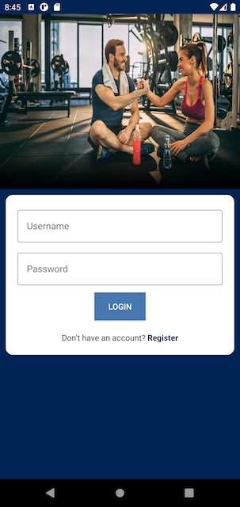
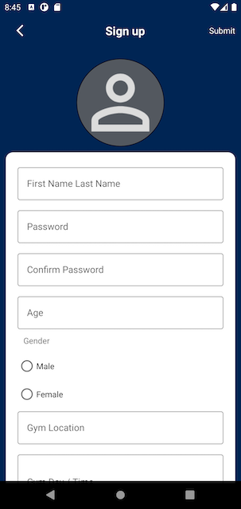

## Project Structure

**Iteration 1**

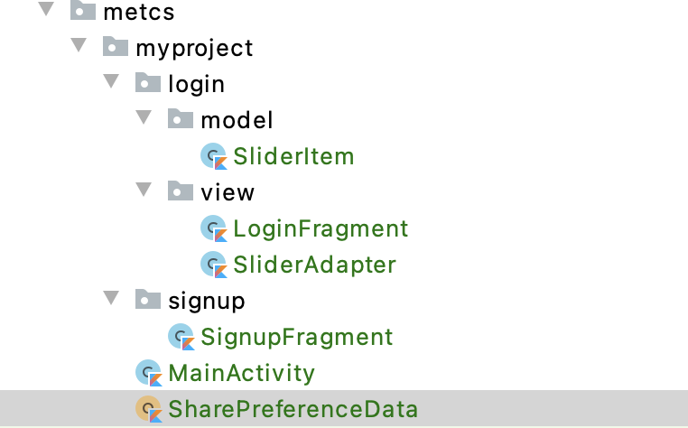
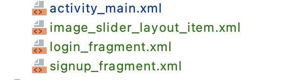

I updated the MainActivity to be Kotlin instead of java and added fragment in its layout for hosting all the screens. I added code to handle the navigation in MainActivity.  
I created two separate package for login and signup and respective fragment for each screen. I added a navigation.xml inside the resource folder to handle the navigation between fragments.  
I updated the layout for each screen  login_fragment and signup_fragment. Added dependendy to handle architecture components and support design.
## References

*(Please list all your references here)*

- https://github.com/smarteist/Android-Image-Slider
- https://github.com/hdodenhof/CircleImageView
- https://github.com/Dhaval2404/ImagePicker

**Iteration 2**

### I have worked on the following in this iteration:

- Implemented Room database
- Validation for Login screen
- Validation for Signup screen
- Save user information in the database
- Frainer List screen UI
- Show list of users from DB
- Fragment backstack handling
- Store logged in user in Shared preference
- Logout

**I have used the following components:**

Frainers screen - RecyclerView, Toolbar, ImageView, TextView, CardView

**Screenshots**

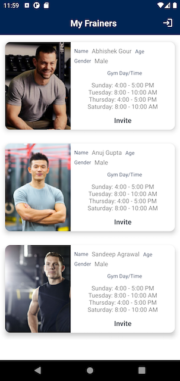
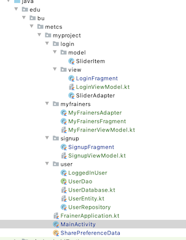
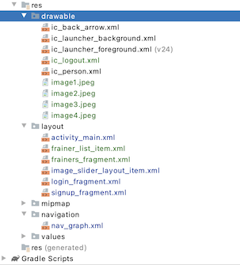

In this iteration I mainly wanted to setup the Database and make sure users can login and signup and see the list of users in the DB. I created the Room database setup and created a viewmodel and repository for handling the User database. I also completed the validation for the login and signup screen so that if a user enters an incorrect password they will be prompted to enter the correct password. Also if a user tries to sign up with an existing user name it will show the toast message to try with a different username. At last, my frainers screen will show all the users existing in the database and allow users to logout. I plan to make the frainers UI much cleaner and also try to add capability to add images in the signup screen which will load up in the my frainer screen in the future iterations.

## References
https://developer.android.com/codelabs/android-room-with-a-view-kotlin#15

**Iteration 3**

### I have worked on the following in this iteration

- Implemented the profile screen
- Implemented the edit profile screen
- Implemented the pending request screen UI
- Implemented the frainer detail screen
- Moved logout in my Profile screen.
- Handled navigation throughout the application
- Bottom navigation

** I have used the following components:**

- BottomNavigationView, RecyclerView, TextView, ImageView, CardView, Fragment, SafeArgs

**Screenshots**

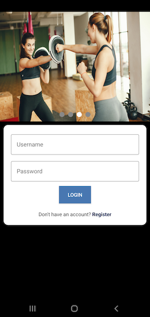
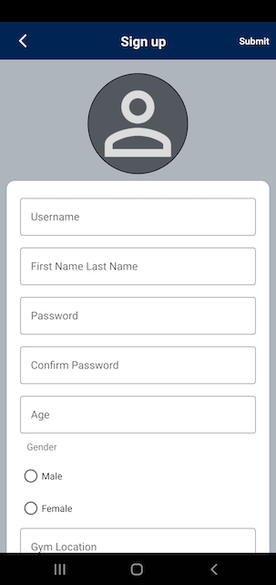
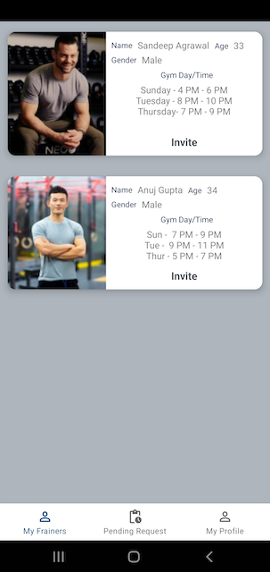
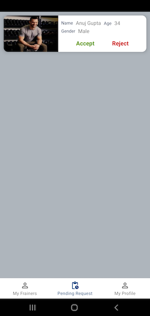
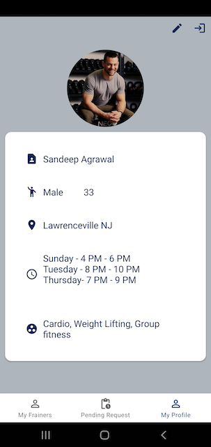
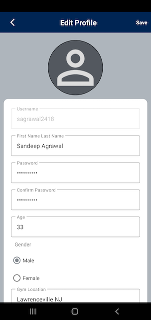

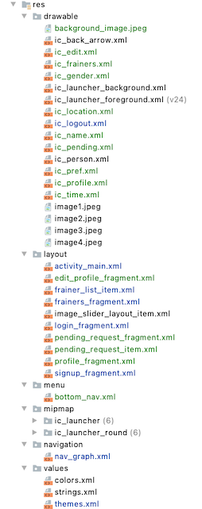

**Iteration 4**

### I have worked on the following in this iteration

- Updated background color
- Passed the user object from the nav graph and get from bundle instead of making get user call
- Trigger notification when user select Invite
- Trigger notification when user select accept/reject

** I have used the following components:**

- Notification, NotificationManager, AlarmManager, BroadCastReceiver

**Screenshots**

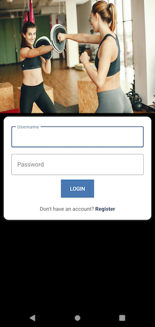
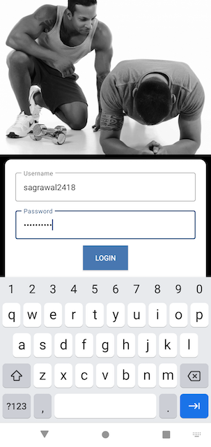
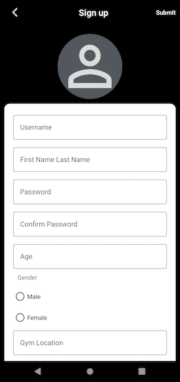
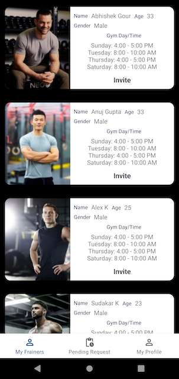
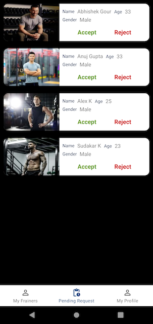
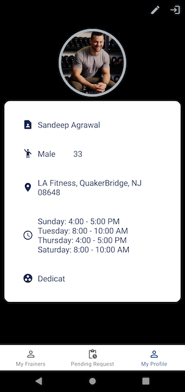
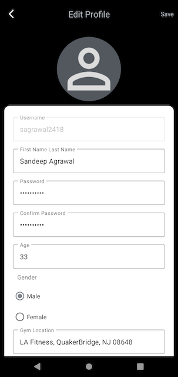
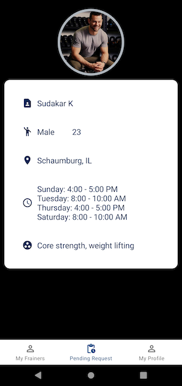
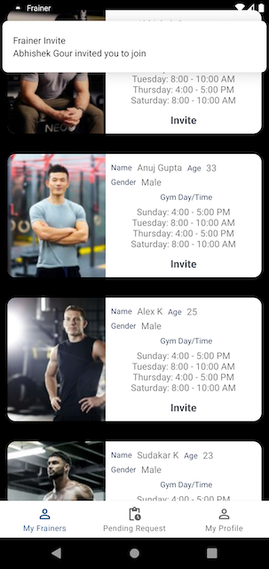

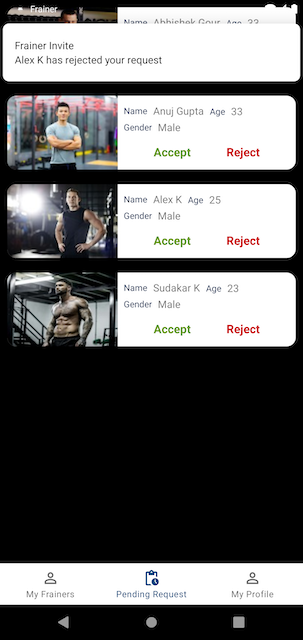
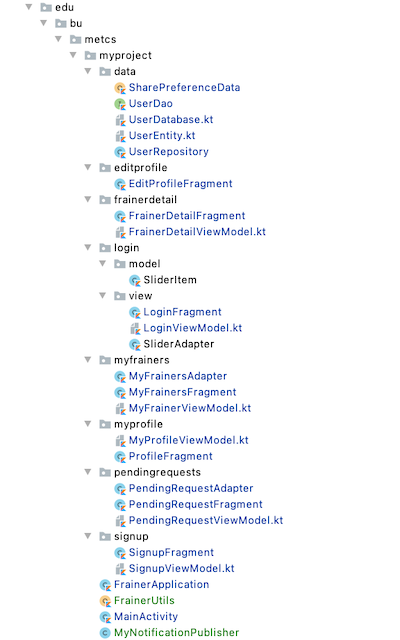
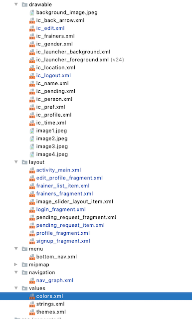

**Iteration 5**

### I have worked on the following in this iteration

- Refactor the following
    1. Removed hard coded strings and moved to strings.xml
    2. Removed hard coded dimensions and moved to dimens.xml
    3. Removed hard coded colors and moved to colors.xml
    4. Refactor code to have proper modifer types.
    5. Reuse method by moving to utils.
    6. Tested the app to make sure everything is working from end to end.

**Screenshots**

